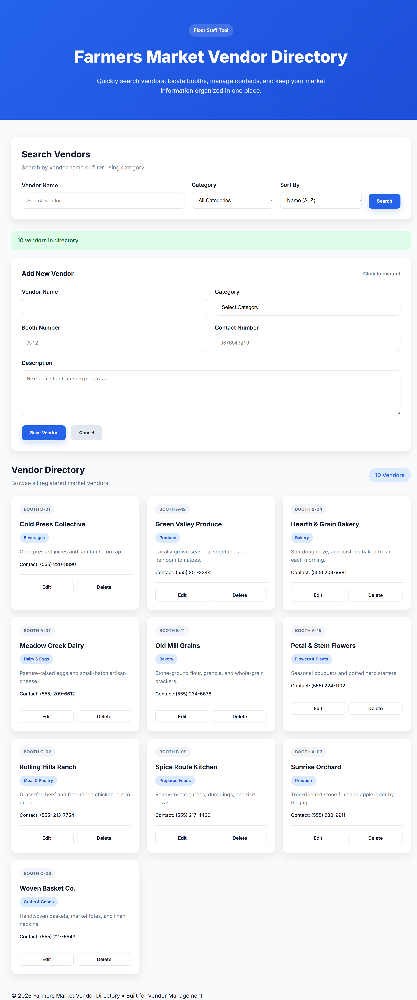

# 🌾 Farmers Market Vendor Directory

A responsive web application for managing and searching farmers' market vendors. Users can search vendors by name, filter them by category, and add new vendors through a validated form. Built using **HTML**, **CSS**, and **JavaScript**, the project demonstrates responsive design, DOM manipulation, form validation, and accessibility best practices.

## 🚀 Features

* 🔍 Search vendors by name
* 🏷️ Filter vendors by category
* ➕ Add new vendors
* ✅ Client-side form validation
* 🛡️ Input sanitisation
* 📋 Dynamic vendor card rendering
* ⏳ Simulated loading states
* 📱 Fully responsive design
* ♿ Semantic HTML & accessibility support

## 📸 Preview




## 🛠️ Technologies Used

* HTML5
* CSS3
* JavaScript (ES6)

## 📂 Project Structure

```text
Farmers-Market-Vendor-Directory/
│── index.html
│── style.css
│── script.js
│── README.md
└── Screenshot.png
```

## ▶️ Getting Started

1. Clone the repository.

   ```bash
   git clone https://github.com/your-username/farmers-market-vendor-directory.git
   ```

2. Open the project folder.

3. Launch `index.html` in your preferred web browser.

No additional dependencies are required.

## 📖 Learning Outcomes

This project helped strengthen skills in:

* DOM Manipulation
* Event Handling
* Form Validation
* Search & Filtering
* Responsive Web Design
* Accessibility
* Clean JavaScript Code Organisation

## 👨‍💻 Developer

**Akarsh Kumar**
* 💼 Aspiring Full Stack Web Developer

## ⭐ Support

If you found this project useful, consider giving it a ⭐ on GitHub!

## 📄 License

This project is created for learning and educational purposes.
